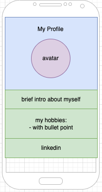

# Lesson

## Lesson Overview

The focus of this lesson is on planning and implementing responsive web design. It is important for learners to understand the what, why and how of responsive web design. Responsive web design enable a webpage to adapt to multiple screen sizes such as laptop, tablet and mobile. Since most consumers are on the mobile today, responsive web design has become crucial for every businesses. We won't be covering all best practices in this lesson but learners should be briefed over the list and know where to source for the information when needed.

## Pre-requisite Installations

- [draw.io for Windows](https://apps.microsoft.com/store/detail/drawio-diagrams/9MVVSZK43QQW?hl=en-us&gl=us)
- [draw.io for MacOS](https://formulae.brew.sh/cask/drawio)

---

## Part 1 - Planning via Wireframe & Code Starter

By the end of this lesson, we want to achieve the following effects:

**Browser View**


**Mobile view**



> The wireframe is drawn using `draw.io`. Before diving into writing html/css code to create your own profile page, we would like take some time to familiarize with wireframing tool such as draw.io, do that we are able to produce a wireframe for all web projects in this program.

### Activity 1 - Get familiar with draw.io

Students should download and install draw.io program. By getting familiar with draw.io, instructors can introduce the following elements in draw.io:

- browser
- mobile
- using rectangle/square element to plan for layout
- using image placeholders
- checkboxes
- text input
- radio buttons
- buttons

### Activity 2 - Lets get started with the starter code

Copy the starter code from the [part1](./src/lesson/part1) folder to [my_web_page](./src/my_web_page/). Modify the details in `my_web_page` folder to fit your own profile.

---

## Part 2 - What is Responsive Web Design & Best Practices

> Responsive Web Design is about using HTML and CSS to automatically resize, hide, shrink, or enlarge, a website, to make it look good on all devices (desktops, tablets, and phones)
> Excerpt from [Reference Link](https://www.w3schools.com/html/html_responsive.asp)

Responsive Web Design is almost mandatory for every consumer based businesses since consumers are mostly on the mobile these days. In this part, we will apply the following to the same profile page from part 1. 

1. viewport (already present, comment it to see difference in responsive view)
1. font size using `vw` unit
1. responsive image using `<picture>`
1. avatar's `max-width:50%`

Let us explore some of the additional code we can include in both files: [index.html](./src/lesson/part2/index.html) and [styles.css](./src/lesson/part2/styles.css) to achieve a more responsive webpage.

index.html
```html
<!DOCTYPE html>
<html lang="en">

<head>
    <meta charset="UTF-8">
    <meta http-equiv="X-UA-Compatible" content="IE=edge">
    <meta name="viewport" content="width=device-width, initial-scale=1.0"> <!-- 1. Once viewport is added, the image and text will comply to the device's screen size. Comment and uncomment this line to observe the difference in the mobile view. -->
    <title>My Profile</title>
    <link rel="stylesheet" type="text/css" href="styles.css">
</head>

<body>
    <div> 
        <h1>My Profile</h1>

        <div id="picture-container">
            <picture> <!-- 2. Add multiple image sources based on device's width -->
                <source srcset="./images/slim-edison.jpeg" media="(max-width: 600px)">
                <source srcset="./images/crab-edison.jpeg" media="(max-width: 1500px)">
                
            </picture>
        </div>
        
        <p class="responsive-font"> <!-- 3. Use .responsive-font class in styles.css. The vw unit will resize the font based on the screen size. Use dev tool to resize the page to observe the front grow/shrink accordingly. -->
            My name is Edison. I am a Software Engineer.
        </p>
        <p>
            My hobbies are:
        <ul>
            <li>Visiting nature parks</li>
            <li>Swimming</li>
        </ul>
        </p>
        <div class="social">
            You can add me on <a href="https://www.linkedin.com/in/edisonzsq/">LinkedIn</a>
        </div>
    </div>
</body>

</html>
```

styles.css
```css
#avatar {
    width:400px;
    border-radius: 50%;
    max-width:50%; 
}

p {
    margin:20px 50px 20px 50px;
}

.responsive-font{
    font-size:5vw;
}

ul {
    margin-left:80px;
}

li {
    padding:4px;
}

.social {
    background-color:skyblue;
    color:#34282C;
    padding:10px;
}

body{
    display:flex;
    justify-content:center;
}
```

---

## Part 3 - Use of `@media` query

Refer to the part3's [index.html](./src/lesson/part3/index.html) and [styles.css](./src/lesson/part3/styles.css) files for this part. The styling has been modified to achieve optimal result for demonstration purpose. We removed the padding/margin of the elements to rely on CSS Flex properties.

Changes:
- Removed padding/margins of elements
- Added more CSS Flex Properties
- Added more `<div>` to act as containers

Run [index.html](./src/lesson/part3/index.html) with live server, view page in dev tool's responsive view, adjust the width of screen to within and beyond 600px to see the following CSS take effect.


```css
#container {
    display:flex;
    justify-content: center;
    align-items:baseline;
    flex-direction: row;
}

@media screen and (max-width: 600px){
    #container {
        flex-direction: column;
    }
}
```
Key observations:
- If the width of screen is 600px and below, use `flex-direction:column;`
- Otherwise, stick to the default `flex-direction:row` declared within `#container` selector 

END